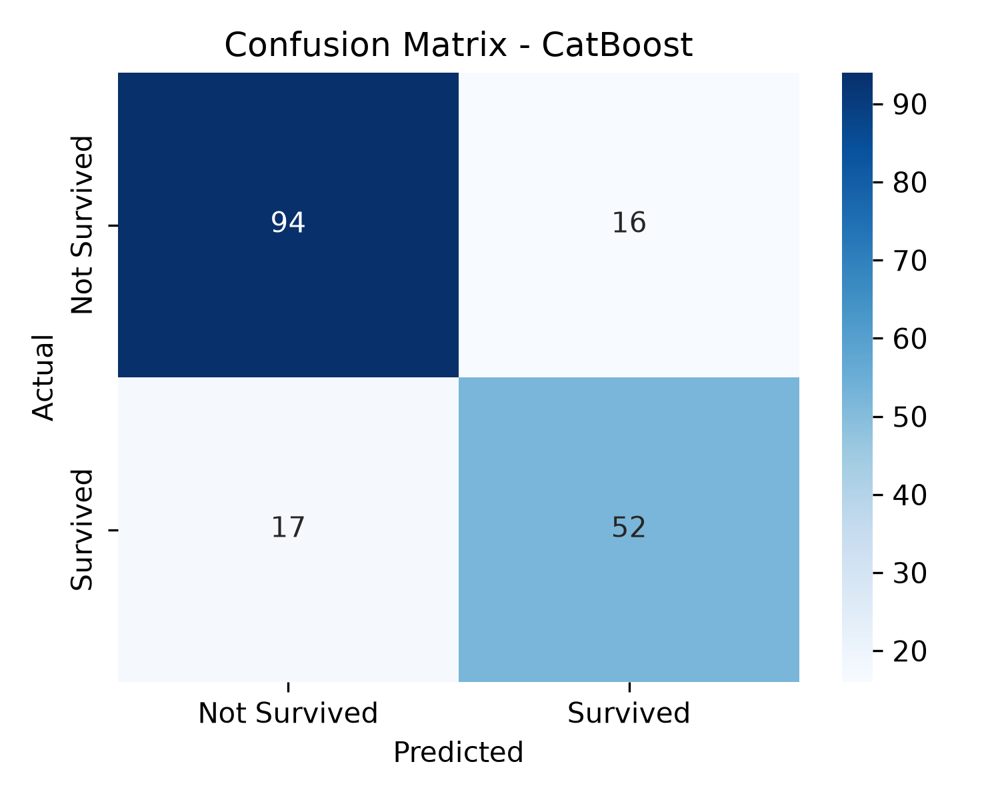
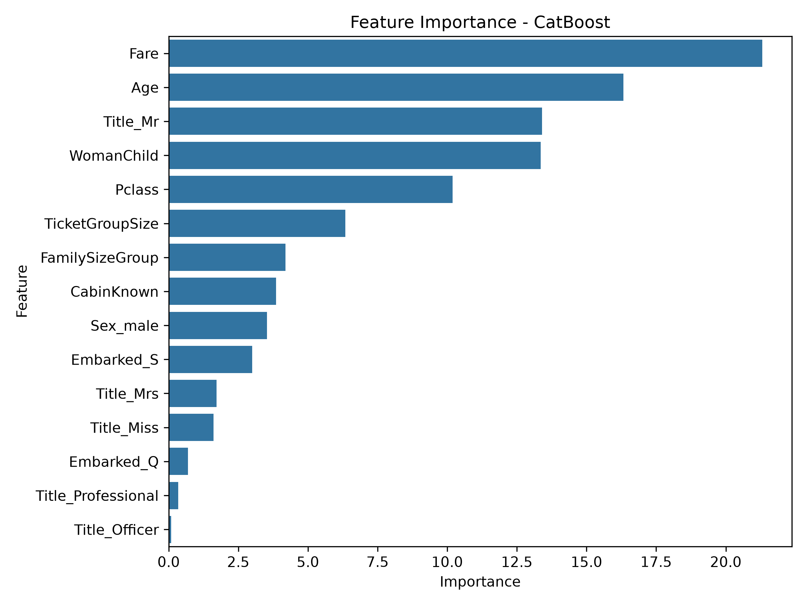

# Titanic Survival Prediction - Machine Learning Learning Project


## About This Project

This repository contains my first machine learning test project based on the Kaggle competition:

**Titanic - Machine Learning from Disaster**

The goal of this project was to learn the fundamentals of building a machine learning classification pipeline, including:

- Data preprocessing
- Feature engineering
- Model training
- Model evaluation
- Cross-validation
- Prediction generation

This project was created as a **learning project as a beginner/student exploring data science and machine learning**. The main purpose was to understand how ML workflows are structured, experiment with different algorithms, and learn from model performance.

A significant portion of the development process involved using AI tools as a learning assistant. AI was used for:

- Understanding machine learning concepts
- Debugging implementation issues
- Exploring feature engineering ideas
- Improving code structure
- Interpreting model results

The focus of this project was not only achieving a prediction score, but also learning the reasoning behind each stage of the machine learning process.

---

# Project Overview

The Titanic dataset contains information about passengers aboard the RMS Titanic. The objective is to predict whether a passenger survived based on available passenger information.

The target variable:

```
Survived
```

The model uses passenger attributes such as:

- Passenger class
- Gender
- Age
- Fare
- Embarkation location
- Passenger title
- Family/group information
- Cabin availability

This is a binary classification problem.

---

# Machine Learning Pipeline

The project follows this workflow:

```
Dataset
   |
   v
Data Cleaning
   |
   v
Feature Engineering
   |
   v
Feature Encoding
   |
   v
Model Training
   |
   v
Stratified Cross Validation
   |
   v
Model Comparison
   |
   v
Final Model Selection
   |
   v
Kaggle Prediction
```

---

# Final Feature Set

After experimenting with different feature combinations, the final model uses:

| Feature | Description |
|---|---|
| Pclass | Passenger ticket class |
| Sex | Passenger gender |
| Age | Passenger age |
| Fare | Ticket price |
| Embarked | Port of embarkation |
| Title | Extracted passenger title from name |
| FamilySizeGroup | Categorised family size |
| TicketGroupSize | Number of passengers sharing a ticket |
| CabinKnown | Whether cabin information exists |
| WomanChild | Identifies women and children groups |

---

# Feature Engineering

Several passenger-related features were created to improve model performance.

## Title Extraction

Passenger names were converted into titles:

```
Mr
Mrs
Miss
Master
Officer
Professional
Royalty
```

Titles provide additional social and demographic information.

## Family Features

Created features to capture family-related survival patterns:

- Family size categories
- Ticket group size

## Cabin Information

Instead of using missing cabin values directly:

```
CabinKnown
```

was created to indicate whether cabin information was available.

## Woman and Child Feature

A combined feature was created based on the historical survival pattern:

```
Women and children were prioritised during evacuation
```

---

# Models Tested

The project compares several machine learning algorithms:

| Model | Description |
|---|---|
| Logistic Regression | Used as a baseline linear classification model. |
| Random Forest | An ensemble model using multiple decision trees. |
| Extra Trees | A randomized tree-based ensemble algorithm. |
| XGBoost | A gradient boosting algorithm commonly used for structured/tabular datasets. |
| CatBoost | A gradient boosting model designed to handle categorical data effectively. |

---

# Model Evaluation

Models were evaluated using:

- Stratified K-Fold Cross Validation
- Accuracy
- Precision
- Recall
- F1 Score
- Confusion Matrix

## Why These Metrics Were Used

### Stratified K-Fold Cross Validation

Instead of relying on a single train-validation split, Stratified K-Fold Cross Validation divides the dataset into multiple folds and trains/evaluates the model several times.

Stratification ensures that each fold maintains a similar proportion of survivors and non-survivors.

This was used because the Titanic dataset contains an imbalance between:

- Survivors
- Non-survivors

Using stratified cross-validation provides a more reliable estimate of how well the model generalises to unseen data.

---

### Accuracy

Accuracy measures the percentage of predictions that the model classified correctly.

It provides an overall measurement of model performance:

```
Correct Predictions / Total Predictions
```

Accuracy is useful for comparing different models, but it should not be used alone because a model could achieve high accuracy while performing poorly on the survivor class.

---

### Precision

Precision measures how many passengers predicted as survivors actually survived.

It answers:

> "When the model predicts survival, how often is it correct?"

Precision is useful because it evaluates the number of false positive predictions, where passengers are predicted to survive but actually did not.

---

### Recall

Recall measures how many actual survivors the model successfully identified.

It answers:

> "Out of all passengers who survived, how many did the model correctly identify?"

Recall is important because failing to identify actual survivors results in false negatives.

---

### F1 Score

F1 Score combines precision and recall into a single metric.

It provides a balance between:

- Correctly predicting survivors
- Finding as many survivors as possible

This is useful because both false positive and false negative predictions are important in a survival prediction problem.

---

### Confusion Matrix

The confusion matrix provides a detailed breakdown of model predictions.

| | Predicted Not Survived | Predicted Survived |
|---|---|---|
| Actual Not Survived | True Negative | False Positive |
| Actual Survived | False Negative | True Positive |



It helps identify the specific types of mistakes made by the model instead of only looking at the overall accuracy.

Latest cross-validation results:

```
LogisticRegression : 0.8193
RandomForest       : 0.8339
ExtraTrees         : 0.8316
XGBoost            : 0.8294
CatBoost           : 0.8384
```

Best performing model:

```
CatBoostClassifier

Cross Validation Accuracy:
83.84%
```

# Feature Importance Analysis

Feature importance was generated from the final trained model to understand which features contributed the most to survival predictions.

The analysis shows which passenger characteristics had the strongest influence on the model's decisions.



The most influential features included:

- Fare
- Age
- Passenger Title (such as Mr, Mrs, Miss)
- WomanChild
- Passenger Class
- Ticket Group Size

These results align with historical patterns from the Titanic disaster, where factors such as social class, gender, age, and available resources affected survival probability.

Feature importance was used as an interpretation tool to better understand the model rather than as a direct indicator of causation.
---

# Project Structure

```
titanic-kaggle/

│
├── data/
│   ├── train.csv
│   └── test.csv
│
├── src/
│   ├── preprocess.py
│   ├── train.py
│   └── predict.py
│
├── outputs/
│   ├── titanic_model.pkl
│   ├── model_columns.pkl
│   ├── threshold.pkl
│   └── submission.csv
│
├── assets/
│   ├── confusion_matrix.png
│   └── feature_importance.png
│
├── experiments.md
└── README.md
```

---

# Running The Project

Install dependencies:

```bash
pip install pandas numpy scikit-learn xgboost catboost matplotlib seaborn joblib
```

Train models:

```bash
python src/train.py
```

This will:

- Process the dataset
- Generate features
- Train multiple ML models
- Perform cross-validation
- Save the best model

Generate predictions:

```bash
python src/predict.py
```

Output:

```
outputs/submission.csv
```

---

# Technologies Used

- Python
- Pandas
- NumPy
- Scikit-learn
- XGBoost
- CatBoost
- Matplotlib
- Seaborn
- Joblib

---

# Learning Outcomes

Through this project, I learned:

- How machine learning pipelines are structured
- How data preprocessing affects model performance
- How feature engineering can improve predictions
- Differences between classification algorithms
- The importance of validation techniques
- How to prepare Kaggle submissions

This project helped me build a foundation in machine learning and understand the process of developing a predictive model from raw data.

---

# Future Improvements

Possible future experiments:

- Ensemble methods such as stacking and voting classifiers
- More advanced hyperparameter tuning
- Model explainability using SHAP
- Better experiment tracking
- Deployment as a small prediction application

---

# Final Note

This repository represents my first step into machine learning and data science.

The project was developed with significant AI assistance, mainly as a learning tool. I used AI to help understand concepts, debug issues, and explore possible approaches while focusing on learning the reasoning behind the workflow and results.
